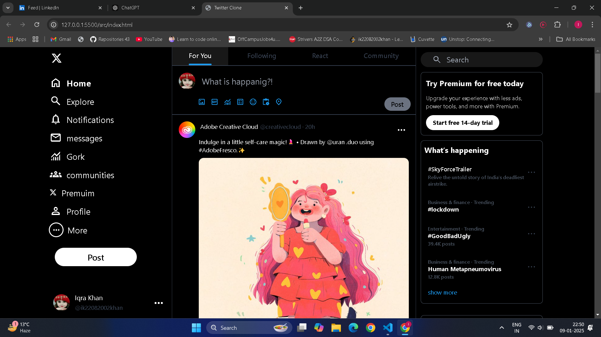
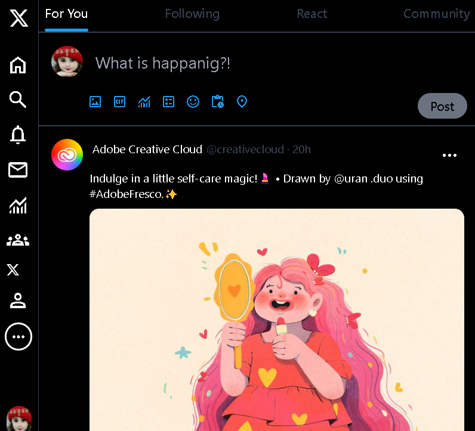
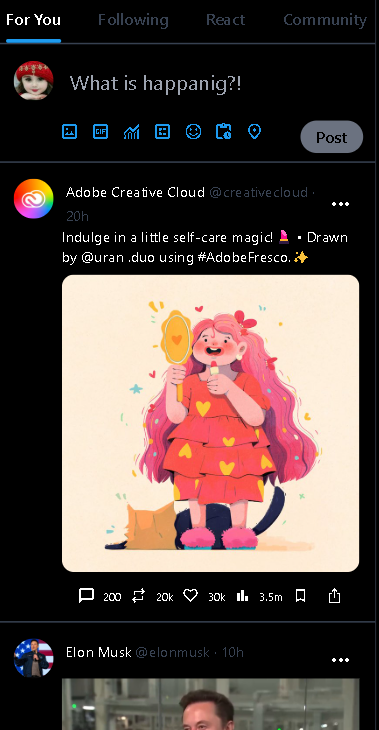

# Twitter Clone

A responsive Twitter clone created using **HTML**, **Tailwind CSS**, and **JavaScript** to replicate the appearance and basic functionality of Twitter.

---

Desktop version


---

tab version


---

mobile version


---

## Features

- Responsive layout with a clean and intuitive design.
- Dark mode styling inspired by Twitter.
- Simulated feed with static posts.
- Functional sidebar navigation with icons.

## Project Structure

```twitter-clone/
├── .gitignore
├── package.json
├── package-lock.json
├── tailwind.config.js
├── Readme.md
├── 📁css |
│ │── input.css
│ └── output.css
├── 📁src
  ├── favicon.ico
  └── index.html
```

## Technologies Used

- **HTML**: For structuring the application.
- **Tailwind CSS**: For styling the application.
- **JavaScript**: For basic interactivity (if applicable).

## How to Use

1. Clone the repository:

   ```bash
   git clone https://github.com/your-username/twitter-clone.git
   ```

2. Navigate to the project directory:

```bash
cd twitter-clone
```

3. Install dependencies:

```
npm install
```

4. Run the Tailwind CLI to build CSS:

```bash
npx tailwindcss -i ./css/input.css -o ./css/output.css --watch
```

or

```bash
npm run build
```

5. Open the `src/index.html` file in your browser to view the project.

Tailwind Configuration
The `tailwind.config.js` file is used to customize the design system and enable required plugins.

Screenshot
Home Page

## Folder Details

### css:

Contains the input and compiled Tailwind CSS files.

### src:

Contains the HTML and static assets (like the favicon).

### .git:

Contains Git configuration files and metadata.
